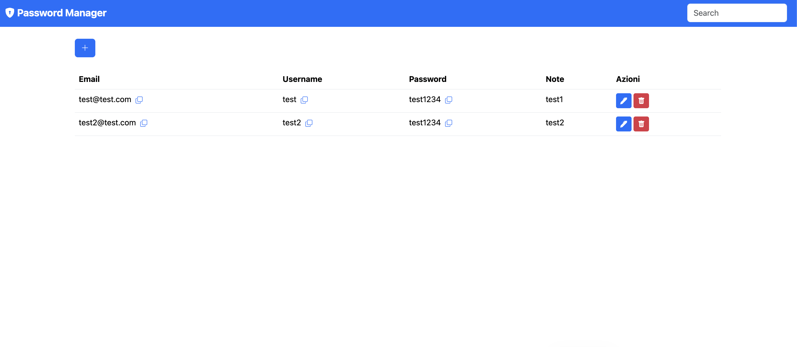

# 🔐 Password Manager

Un'app web semplice per gestire le tue password in locale, costruita con **Flask** e **SQLite**.

---

## ✨ Funzionalità

- ➕ Aggiunta di nuove password (email, username, password, note)
- ✏️ Modifica di password esistenti tramite modal
- 🗑️ Eliminazione con modal di conferma
- 📋 Copia rapida di email, username e password con un click
- 🔍 Ricerca in tempo reale nella tabella

---

## � Screenshot



---


## �🚀 Avvio rapido

### 1. Clona il repository

```bash
git clone https://github.com/TUO_USERNAME/database-password.git
cd database-password
```

### 2. Crea e attiva l'ambiente virtuale

```bash
# Crea il venv
python3 -m venv venv

# Attiva su macOS/Linux
source venv/bin/activate

# Attiva su Windows
venv\Scripts\activate
```

### 3. Installa le dipendenze

```bash
pip install -r requirements.txt
```

### 4. Inizializza il database

```bash
python3 db.py
```

> Questo comando crea il file `manager.db` con la tabella necessaria.

### 5. Avvia l'applicazione

```bash
flask --app app run --port=5001
```

Apri il browser e vai su **http://127.0.0.1:5001**

---

## 📁 Struttura del progetto

```
database-password/
├── app.py              # Backend Flask (route e API)
├── db.py               # Script di inizializzazione database
├── database.sql        # Schema SQL della tabella
├── requirements.txt    # Dipendenze Python
├── static/
│   └── script.js       # Logica JavaScript (CRUD + copia)
└── templates/
    └── index.html      # Interfaccia utente
```

---

## ⚙️ API disponibili

| Metodo | Endpoint | Descrizione |
|--------|----------|-------------|
| `GET` | `/` | Pagina principale |
| `POST` | `/api/add` | Aggiunge una password |
| `PUT` | `/api/update/<id>` | Modifica una password |
| `DELETE` | `/api/delete/<id>` | Elimina una password |

---

## ⚠️ Note

- Il database `manager.db` è escluso dal repository (`.gitignore`) — le tue password restano **solo in locale**.
- Questa app è pensata per uso **personale e locale**. Non esporla su internet senza un layer di autenticazione.
- La porta `5000` su macOS è occupata da AirPlay Receiver: usa sempre `--port=5001`.